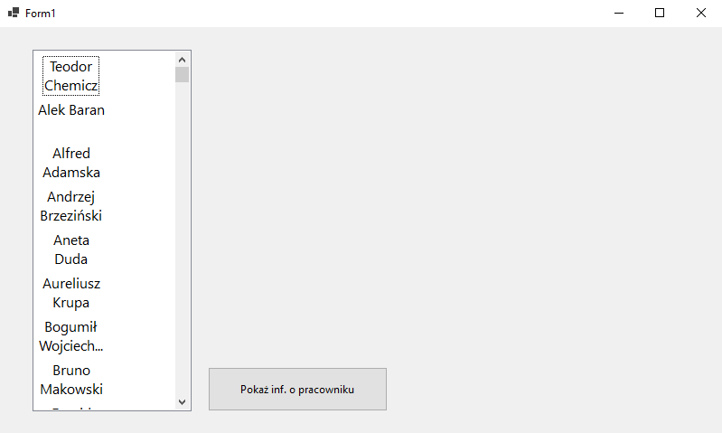
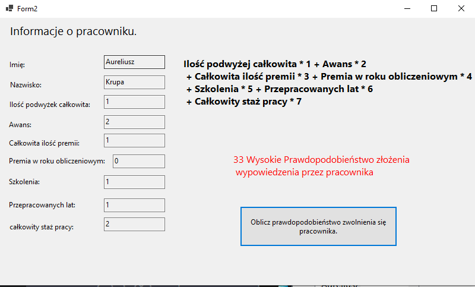
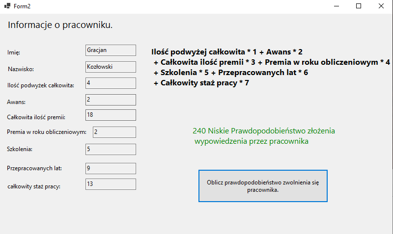

## Opis projektu

Program który oblicza prawdopodobieństwo odejścia pracownika z firmy.

Punktowane pozycje: 
przykładowe wynagrodzenie w rynku, podwyżka, awans, premia, szkolenia.  

Podwyżka to 1 pkt 
 awans 2 pkt 
 premia 3 pkt 
szkolenie 5 pkt.  

Mniej niż. 99 pkt. to bardzo wysokie prawdopodobieństwo że odejdzie, 100-199 to średnie
prawdopodobieństwo że odejdzie, 200 i więcej to nikłe prawdopodobieństwo że odejdzie.  

## Zdjęcia

Załączone zrzuty przedstawiający rzeczywisty widok programu

## Autorzy

Zbigniew Adamek,
Mateusz Adamczyk,
Teodor Chemicz

## Licencja

 MIT License

## Wersja
Aktualna wersja projektu: 1.0.0 (ostateczna)

## Podziękowania

Serdecznie podziękowania dla naszej wykładowczyni, bez której nie rozpoczelibyśmy pracy nad projektem,
oraz całej społeczności Open Source, dzięki której mieliśmy dostęp do potrzebnych informacji
w trakci pracy nad projektem

